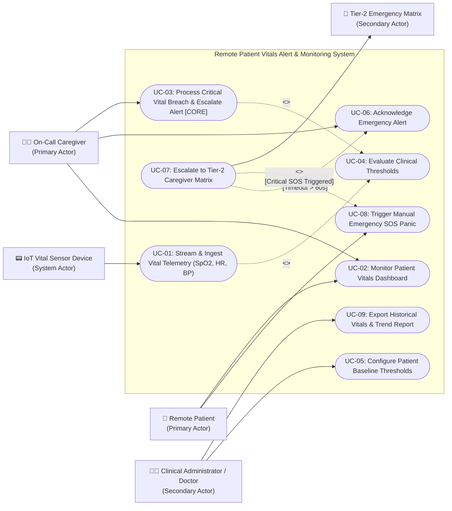

# Lab 1: Requirements Engineering & UML Use-Case Modelling

**Department:** Department of Computer Science & Engineering, PES University  
**Course:** Software Engineering Lab (SE-Labs)  
**Problem Statement #16:** Remote Patient Vitals Alert & Monitoring App  
**Domain:** Healthcare & Telemedicine  
**Student SRN:** `PES1UG24CS384`  
**Target Stakeholders / Actors:** Remote Patient, On-Call Caregiver  

---

## Deliverables Index

All Lab 1 deliverables have been prepared in strict accordance with the PES University CSE lab guidelines:

1. [📋 **Complete Requirements Table** (`requirements.md`)](./requirements.md)
   - Exactly 5 Functional Requirements (`FR-001` to `FR-005`)
   - Exactly 2 Non-Functional Requirements (`NFR-001` & `NFR-002`)
   - Formatted with: `Req ID`, `Type`, `Description ("The system shall...")`, `Priority (High/Medium/Low)`, `Acceptance Criteria (Measurable Pass/Fail)`, and `Rationale`.
2. [🖼️ **UML Use-Case Diagram** (`usecase_diagram.md`)](./usecase_diagram.md)
   - Diagram source files: [`usecase_diagram.drawio`](./usecase_diagram.drawio) (Draw.io / Lucidchart XML), [`usecase_diagram.svg`](./usecase_diagram.svg) (Vector graphics), and [`usecase_diagram.puml`](./usecase_diagram.puml) (PlantUML).
   - Models all actors (`Remote Patient`, `On-Call Caregiver`, `Doctor/Admin`, `IoT Sensor Device`, `Tier-2 Matrix`).
   - Includes system boundary, labeled use cases `UC-01` to `UC-09`, associations, and `<<include>>` / `<<extend>>` relationships.
3. [📄 **Use-Case Flow Specification** (`usecase_specification.md`)](./usecase_specification.md)
   - 1-Page specification for core use case: `UC-03: Process Critical Vital Breach & Escalate Caregiver Alert`.
   - Preconditions, Postconditions, Step-by-Step Main Success Scenario (MSS), and Step-by-Step Alternate Flows (`5a. Caregiver Timeout`, `5b. Sensor Disconnection`).

---

## 1. Problem Context & Overview

The **Remote Patient Vitals Alert & Monitoring App** provides an automated, continuous telemetry ingestion and clinical alert pipeline for post-operative patients recovering in home-care settings. Post-surgical patients are susceptible to rapid physiological deterioration such as acute hypoxia ($\text{SpO}_2 < 90\%$), tachycardia/bradycardia, and hypertensive crises.

The system continuously streams biometric telemetry (`SpO2`, `Heart Rate`, `Blood Pressure`) from connected wearable IoT sensors, evaluates metrics against personalized clinical baseline thresholds within 2 seconds, and escalates emergency alerts through a multi-tier caregiver matrix.

---

## 2. Complete Requirements Table

| Req ID | Type | Description | Priority | Acceptance Criteria | Rationale |
| :--- | :--- | :--- | :--- | :--- | :--- |
| **FR-001** | Functional | The system shall continuously evaluate ingested patient vitals against configured clinical thresholds and flag critical anomalies within 2 seconds. | **High** | **Pass:** High heart rate (>140 BPM), critical hypoxia (SpO2 < 90%), or severe BP spike triggers immediate escalation alert in $\le 2\text{s}$. **Fail:** Metric spike ignored, dropped, or evaluation delayed > 5s. | Real-time anomaly detection is essential for post-operative patient safety to prevent acute cardiac/respiratory failure. *(Given Guideline)* |
| **FR-002** | Functional | The system shall allow authorized clinicians to configure and dynamically update patient-specific baseline vitals thresholds without requiring system downtime. | **High** | **Pass:** Clinician updates take effect in the live stream evaluation pipeline within 10 seconds. **Fail:** Default global limits override patient customization or updates cause stream disruption. | Post-surgical recovery boundaries vary significantly by patient age, surgical history, and preexisting conditions. |
| **FR-003** | Functional | The system shall dispatch emergency alerts to the assigned primary On-Call Caregiver and automatically escalate to Tier-2 backup medical staff if unacknowledged within 60 seconds. | **High** | **Pass:** Push/SMS alert reaches primary caregiver within 3s; escalates to Tier-2 after 60s timeout if unacknowledged. **Fail:** Alert remains unescalated on unacknowledged tier past 60s. | Prevents single-point-of-failure in human response; ensures critical patient alerts receive timely medical triage. |
| **FR-004** | Functional | The system shall provide an accessible, one-touch Emergency SOS Panic button on the Remote Patient interface that broadcasts an immediate distress alert with live location and vitals snapshot. | **High** | **Pass:** Single-tap SOS transmits urgent alert to caregiver and emergency matrix in $< 1\text{s}$ with GPS/room data. **Fail:** SOS action fails, lags $> 2\text{s}$, or fails to attach location/vitals snapshot. | Allows patients experiencing acute symptoms (e.g., severe dizziness, acute chest pain) to manually trigger emergency help. |
| **FR-005** | Functional | The system shall persist timestamped historical vitals telemetry and provide automated graphical trend analytics and downloadable clinical summary reports (PDF/CSV) for daily doctor review. | **Medium** | **Pass:** 24-hour vitals summary report with trend graphs compiles and exports in $< 3\text{s}$ with zero data loss. **Fail:** Telemetry data gaps exist, export takes $> 5\text{s}$, or timestamps are misaligned. | Enables attending physicians to track recovery progression, detect subtle hemodynamic degradation, and adjust post-op medications. |
| **NFR-001** | Nonfunctional | The telemetry ingestion gateway shall support at least 500 concurrent continuous telemetry streams with 99.99% uptime. | **High** | **Pass:** Benchmarking tests confirm target latency ($p99 < 500\text{ms}$) and security standards under simulated peak load (500 continuous streams). **Fail:** Gateway crashes, drops packets $> 0.01\%$, or latency exceeds 1s under peak load. | Telemedicine infrastructure must handle multi-patient loads in real time without dropping telemetry packets during critical events. *(Given Guideline)* |
| **NFR-002** | Nonfunctional | The system shall enforce end-to-end encryption for all Protected Health Information (PHI) using TLS 1.3 in transit and AES-256 at rest, coupled with strict Role-Based Access Control (RBAC) and audit logging. | **High** | **Pass:** All network payloads and database records are verified encrypted (TLS 1.3 / AES-256), and unauthorized telemetry access attempts are blocked and logged with 100% audit integrity. **Fail:** Plaintext PHI exposed in transit or logs. | Compliance with statutory healthcare regulations (HIPAA/GDPR) and patient privacy protection are mandatory for medical telemetry. |

---

## 3. UML Use-Case Diagram

---

## 4. Use-Case Flow Specification (Core: UC-03)

### Use Case: UC-03 - Process Critical Vital Breach & Escalate Caregiver Alert

- **Primary Actor(s):** Remote Patient, On-Call Caregiver
- **Secondary Actor(s):** IoT Vital Sensor Device, Tier-2 Emergency Response Matrix

#### Preconditions
1. Remote patient is wearing paired, calibrated vital sensors.
2. Clinical baseline thresholds are configured and loaded into the evaluation pipeline.
3. Caregiver escalation hierarchy is active with primary and secondary contacts.

#### Postconditions
- Critical anomaly is acknowledged and triaged; audit log records full timeline.
- Unacknowledged alerts escalate automatically to Tier-2 backup caregivers after 60 seconds.

#### Main Success Scenario (MSS)
1. The **IoT Vital Sensor Device** transmits a continuous telemetry packet containing abnormal vitals (e.g., $\text{SpO}_2 = 86\%$, $\text{HR} = 148\text{ BPM}$).
2. System ingests telemetry data, decrypts payload, and executes `<<include>> UC-04: Evaluate Clinical Thresholds`.
3. System confirms that readings breach configured baseline thresholds and flags priority status as `CRITICAL_ANOMALY` within **2 seconds**.
4. System constructs an emergency alert payload containing patient ID, room location, live vitals snapshot, and timestamp.
5. System dispatches a high-priority audible push notification and SMS alert to the assigned **On-Call Caregiver**.
6. **On-Call Caregiver** receives the alert, views the patient's real-time telemetry dashboard, and taps **"Acknowledge & Triage"**.
7. System updates alert status to `ACKNOWLEDGED`, silences repeating audible alarms, and displays a notification on the patient interface that caregiver assistance is active.
8. System logs caregiver ID, response time, and vital telemetry snapshot into the clinical audit repository.
9. **Use case ends successfully.**

#### Alternate Flows
- **5a. Primary Caregiver Timeout (Unacknowledged Alert):**
  - **5a1.** Upon dispatching the emergency alert (Step 5), the system initiates an automated **60-second countdown timer**.
  - **5a2.** The 60-second timer expires without receiving an acknowledgment from the primary On-Call Caregiver.
  - **5a3.** System flags the primary caregiver as `UNRESPONSIVE`, logs a timeout event in the audit trail, and triggers `<<extend>> UC-07: Escalate to Tier-2 Caregiver Matrix`.
  - **5a4.** System broadcasts simultaneous emergency alerts to Tier-2 backup medical staff and hospital rapid response dispatchers.
  - **5a5.** A Tier-2 emergency responder acknowledges the alert; system assigns triage to Tier-2 responder and proceeds to Step 7.
- **5b. Sensor Telemetry Disconnection During Active Breach:**
  - **5b1.** If sensor connectivity drops during an active critical breach event, the system locks the last valid abnormal vitals snapshot.
  - **5b2.** System appends a `SENSOR_OFFLINE_WARNING` banner to the caregiver alert payload and continues high-priority escalation.
  - **5b3.** Upon sensor reconnection, the live stream resumes and updates the triage screen automatically.
