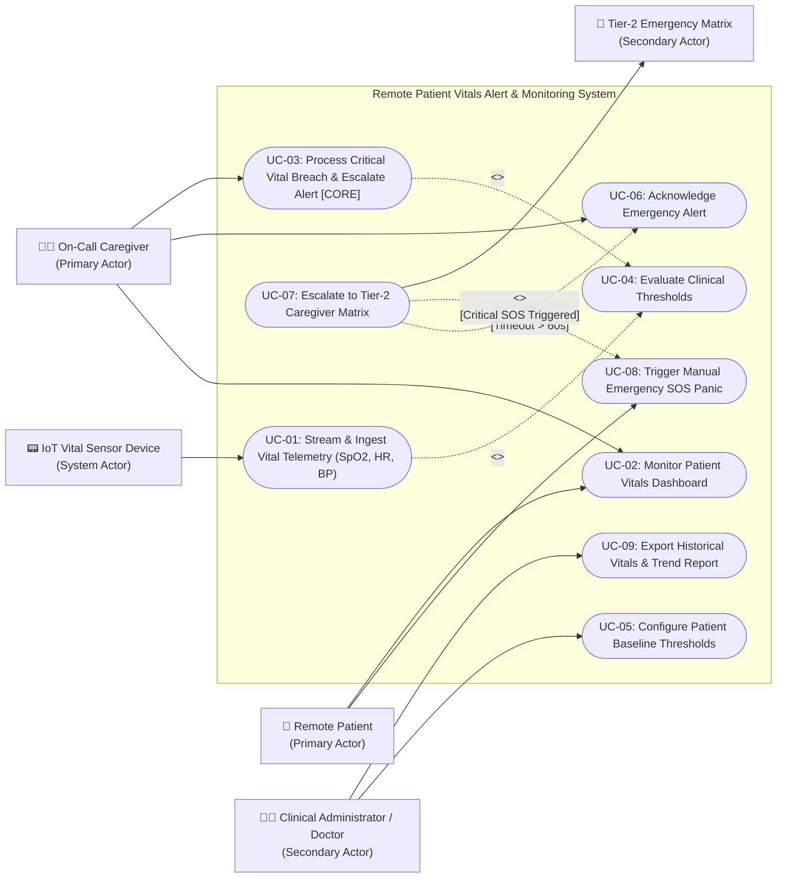

# UML Use-Case Diagram

**Department:** Department of Computer Science & Engineering, PES University  
**Problem Statement #16:** Remote Patient Vitals Alert & Monitoring App  
**Student SRN:** `PES1UG24CS384`  

---

## 1. Visual Use-Case Diagram

### Diagram Files
- 📄 **Draw.io Source File:** [`usecase_diagram.drawio`](./usecase_diagram.drawio) (can be opened directly in [draw.io](https://app.diagrams.net) or Lucidchart)
- 🖼️ **Vector SVG Diagram:** [`usecase_diagram.svg`](./usecase_diagram.svg)
- 📝 **PlantUML Model:** [`usecase_diagram.puml`](./usecase_diagram.puml)

---

### Embedded Architecture (Mermaid)

---

## 2. Key Model Elements

### A. Actors (Extracted $\ge 3$)
1. **Remote Patient (Primary):** Post-operative patient wearing biometric sensors, viewing health status, and utilizing the emergency SOS trigger.
2. **On-Call Caregiver (Primary):** Assigned healthcare provider receiving automated vital breach alerts, viewing real-time telemetry, and acknowledging clinical interventions.
3. **IoT Vital Sensor Device (System/Hardware):** Connected pulse oximeters, ECG/HR patches, and blood pressure monitors generating real-time telemetry streams.
4. **Clinical Administrator / Doctor (Secondary):** Attending physician configuring baseline thresholds and evaluating 24-48h trend analytics.
5. **Tier-2 Emergency Matrix (Secondary):** Rapid response team or secondary on-call staff receiving escalated alerts upon caregiver timeout.

### B. Use Cases (Extracted $\ge 5$)
- **UC-01:** Stream & Ingest Vital Telemetry (SpO2, HR, BP)
- **UC-02:** Monitor Patient Vitals Dashboard
- **UC-03:** Process Critical Vital Breach & Escalate Caregiver Alert *(Core Use Case)*
- **UC-04:** Evaluate Clinical Thresholds
- **UC-05:** Configure Patient Baseline Thresholds
- **UC-06:** Acknowledge Emergency Alert
- **UC-07:** Escalate to Tier-2 Caregiver Matrix
- **UC-08:** Trigger Manual Emergency SOS Panic
- **UC-09:** Export Historical Vitals & Trend Report

### C. Stereotype Relationships
- **Include (`<<include>>`):**
  - `UC-03` $\xrightarrow{\ll\text{include}\gg}$ `UC-04`: Ingestion and breach processing mandatorily invoke clinical threshold evaluation.
  - `UC-01` $\xrightarrow{\ll\text{include}\gg}$ `UC-04`: Continuous telemetry streaming continuously invokes real-time evaluation logic.
- **Extend (`<<extend>>`):**
  - `UC-07` $\xrightarrow{\ll\text{extend}\gg}$ `UC-06`: If the primary On-Call Caregiver does not acknowledge within 60s (Extension Point: `[Timeout > 60s]`), the workflow extends to notify the backup Tier-2 matrix.
  - `UC-07` $\xrightarrow{\ll\text{extend}\gg}$ `UC-08`: When a patient triggers a manual panic SOS, the system extends notification immediately to Tier-2 emergency dispatchers.
