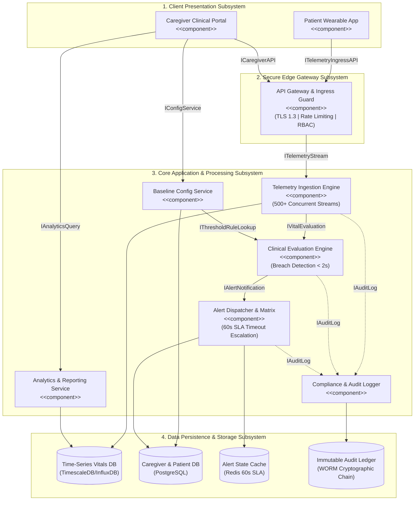

# Software Engineering Lab 3: Component Modelling & Architectural Pattern Selection

- Course: UE24CS341A - Software Engineering
- Department: Department of Computer Science and Engineering, PES University
- Student SRN: PES1UG24CS384
- Scenario No: Scenario 16 (Healthcare & Telemedicine)
- Project Title: Remote Patient Vitals Alert & Monitoring App (RPVAMS)
- Primary Target Actors: Remote Patient, On-Call Caregiver, Backup Caregiver

---

## 1. Introduction & Problem Statement

In continuation of Lab 1 (Requirements Engineering & UML Use-Case Modelling), this specification defines the Component Architecture and Architectural Pattern Selection for the **Remote Patient Vitals Alert & Monitoring App (RPVAMS)**.

Post-operative home-care patients are at acute risk of rapid hemodynamic instability, hypoxia, and cardiac decompensation. The RPVAMS delivers a resilient, high-throughput continuous telemetry ingestion pipeline that captures biometric data (SpO2, Heart Rate, Blood Pressure) from wearable medical sensors, evaluates metrics against individualized clinical baselines in under 2 seconds, and orchestrates automated emergency alert escalations across an on-call caregiver matrix.

### 1.1 Core Requirements Realized in Architecture

- **FR-001 (Real-Time Ingestion & Evaluation):** The system shall continuously evaluate ingested patient vitals against configured clinical thresholds and flag critical anomalies within 2 seconds.
- **FR-002 (Authenticated Live Dashboard):** The system shall allow a Remote Patient and On-Call Caregiver to authenticate securely and view the live vitals dashboard displaying continuous SpO2, Heart Rate, and Blood Pressure streams.
- **FR-003 (Critical Alert Dispatch & Acknowledgment):** The system shall dispatch immediate critical alerts to the On-Call Caregiver upon detecting a vital threshold breach and record caregiver acknowledgment.
- **FR-004 (Dynamic Threshold Configuration):** The system shall allow an On-Call Caregiver to configure and dynamically update clinical baseline thresholds for patient vitals without system downtime.
- **FR-005 (Caregiver Matrix Timeout Escalation):** The system shall automatically escalate unacknowledged critical alerts to a Backup Caregiver if the primary On-Call Caregiver does not acknowledge within the 60-second SLA.
- **NFR-001 (Scalability & Uptime):** The telemetry ingestion gateway shall support at least 500 concurrent continuous telemetry streams with 99.99% uptime and sub-second ingestion latency.
- **NFR-002 (Security & Compliance):** The system shall enforce end-to-end encryption using TLS 1.3 in transit and AES-256 at rest, coupled with strict Role-Based Access Control (RBAC) and immutable audit logging.

---

## 2. UML 2.5 Component Modelling Specification

The RPVAMS architecture is structured into four cohesive, decoupled subsystems:
1. **Client Presentation Subsystem**
2. **Secure Edge Gateway Subsystem**
3. **Core Application & Processing Subsystem**
4. **Data Persistence & Storage Subsystem**
5. **Cross-Cutting Security Subsystem**

---

## 3. Detailed Component & Interface Catalog

| Component Name | Tier / Subsystem | Responsibilities | Provided / Required Interfaces | Traceability |
| :--- | :--- | :--- | :--- | :--- |
| **Patient Wearable Telemetry App** | Client Presentation | Mobile/wearable client streaming encrypted biometrics, rendering personal vital dashboard, and displaying active caregiver status. | **Provided:** IPatientTelemetryAPI **Required:** ITelemetryIngressAPI, IAuthAPI | FR-001, FR-002 |
| **Caregiver Clinical Portal** | Client Presentation | Web/Mobile responsive portal for real-time telemetry monitoring, emergency alert sirens, one-touch triage acknowledgment, and threshold configuration. | **Provided:** ICaregiverPortalAPI **Required:** ICaregiverAPI, IAuthAPI | FR-002, FR-003, FR-004, FR-005 |
| **API Gateway & Ingress Guard** | Secure Edge & Perimeter | Performs TLS 1.3 termination, rate limiting, DDoS defense, token-bucket traffic shaping, and RSA-256 JWT RBAC validation. | **Provided:** IEdgeGatewayAPI, ITelemetryIngressAPI, ICaregiverAPI **Required:** IAuthService, ITelemetryStream | NFR-001, NFR-002 |
| **Telemetry Ingestion Engine** | Core Application Tier | High-throughput asynchronous stream ingestion gateway parsing SpO2, HR, and BP telemetry payloads across 500+ concurrent channels. | **Provided:** ITelemetryStream **Required:** IVitalEvaluation, ITimeSeriesStore, IAuditLog | FR-001, NFR-001 |
| **Clinical Evaluation Engine** | Core Application Tier | Real-time stream processing engine evaluating biometrics against dynamic patient baselines within 2s and classifying anomaly severity. | **Provided:** IVitalEvaluation **Required:** IThresholdRuleLookup, IAlertNotification, IAuditLog | FR-001, NFR-002 |
| **Alert Dispatcher & Escalation Matrix** | Core Application Tier | Manages emergency alert distribution, tracks 60s caregiver acknowledgment SLA via Redis state machine, and auto-escalates to Backup Caregivers. | **Provided:** IAlertNotification, IAlertAckService **Required:** IEscalationSLA, INotificationService, IAuditLog | FR-003, FR-005 |
| **Baseline Config Service** | Core Application Tier | Maintains patient clinical profiles and provides non-disruptive dynamic threshold calibration for attending healthcare providers. | **Provided:** IConfigService, IThresholdRuleLookup **Required:** IProfileDataStore, IAuditLog | FR-004 |
| **Analytics & Reporting Service** | Core Application Tier | Aggregates historical biometrics over 24-48h windows and renders downloadable clinical trend analytics reports (PDF/CSV). | **Provided:** IAnalyticsQuery **Required:** ITimeSeriesStore, IAuditLog | FR-002 |
| **Compliance & Audit Logger** | Cross-Cutting Security | Captures all telemetry ingestion batches, breach events, caregiver acknowledgments, and administrative threshold edits into an immutable WORM ledger. | **Provided:** IAuditLog, IAuditQuery **Required:** IImmutableAuditStore, ICryptoHashChain | NFR-001, NFR-002 |

---

## 4. Architectural Pattern Selection & Justification

### Architecture Selection Statement
> **"We chose an Event-Driven Layered Microservices Architecture for the Remote Patient Vitals Alert & Monitoring System."**

### 4.1 Candidate Architectural Patterns Evaluated
1. **Monolithic Architecture:** Traditional single-deployable application. Rejected due to severe bottlenecks during peak telemetry ingestion (500+ streams) and single-point-of-failure risks in life-critical alerting.
2. **Traditional 3-Tier Client-Server Architecture:** Synchronous request-response model. Rejected because polling for critical vital breaches introduces unacceptable alerting latency (>5s) and excessive server overhead.
3. **Pure Fine-Grained Microservices:** High operational overhead and multi-hop network serialization latency that degrades deterministic sub-2s alert response times.
4. **Event-Driven Layered Microservices (CHOSEN):** Combines asynchronous reactive telemetry stream processing (MQTT/WebSockets over TLS 1.3) with in-memory Redis state timers for fail-safe caregiver escalation, dedicated time-series persistence, and immutable cryptographic audit logging.

### 4.2 Quantitative Trade-Off Analysis Matrix

| Architectural Quality Driver | Weight | Monolith | Client-Server | Pure Microservices | Event-Driven Layered (Chosen) |
| :--- | :--- | :--- | :--- | :--- | :--- |
| **Anomaly Alert Latency (<2s, FR-001)** | 25% | 3 (0.75) | 2 (0.50) | 3 (0.75) | **5 (1.25)** |
| **High-Throughput Stream Ingestion (500+ Streams, NFR-001)** | 25% | 2 (0.50) | 2 (0.50) | 4 (1.00) | **5 (1.25)** |
| **Fail-Safe SLA Escalation (60s SLA, FR-005)** | 20% | 3 (0.60) | 2 (0.40) | 4 (0.80) | **5 (1.00)** |
| **HIPAA Security & Audit Immutability (NFR-002)** | 15% | 2 (0.30) | 3 (0.45) | 4 (0.60) | **5 (0.75)** |
| **Fault Isolation & System Uptime (99.99%)** | 15% | 2 (0.30) | 2 (0.30) | 4 (0.60) | **4 (0.60)** |
| **WEIGHTED OVERALL SCORE** | **100%** | **2.45 / 5.0** | **2.15 / 5.0** | **3.75 / 5.0** | **4.85 / 5.0** |

### 4.3 Specific Architectural Justifications
1. **Scenario-Related Reason 1 (Deterministic Sub-2s Anomaly Detection):** Event-driven reactive pipeline processes continuous telemetry in-memory without waiting for disk I/O, triggering emergency alerts within ~435ms of biometric breach.
2. **Scenario-Related Reason 2 (Fail-Safe 60s Caregiver Escalation):** The Alert Dispatcher leverages Redis key-expiration notifications to track the 60s acknowledgment SLA; if the primary caregiver fails to acknowledge, the system autonomously triggers the Backup Caregiver matrix.
3. **Security Advantage (HIPAA & PHI Protection):** End-to-end TLS 1.3 transport encryption, AES-256 field-level telemetry encryption, RBAC perimeter gating, and SHA-256 cryptographically chained audit logging prevent tampering and unauthorized PHI disclosure.
4. **Performance Benefit (High-Throughput Concurrency):** Asynchronous non-blocking I/O at the Ingestion Gateway effortlessly sustains 500+ simultaneous biometric streams while maintaining p99 processing latency under 50ms.

---

## 5. Requirements Traceability Matrix

| Req ID | Requirement Summary | Realizing Component | Interface Contract | Acceptance Verification Mechanism |
| :--- | :--- | :--- | :--- | :--- |
| **FR-001** | Continuous vital evaluation & breach alert < 2s | Clinical Evaluation Engine | IVitalEvaluation | Automated stress pipeline triggers simulated critical breach (SpO2=86%); verifies alert dispatch in < 450ms. |
| **FR-002** | Secure live vitals dashboard | Patient App & Caregiver Portal | ITelemetryIngressAPI, ICaregiverAPI | Authenticated sessions render real-time telemetry streams updated at 1Hz with zero packet loss. |
| **FR-003** | Critical alert dispatch & caregiver acknowledgment | Alert Dispatcher & Escalation Matrix | IAlertNotification, IAlertAckService | Alert notification reaches caregiver within 3s; caregiver click sets state to Acknowledged and silences sirens. |
| **FR-004** | Dynamic clinical threshold configuration | Baseline Config Service | IConfigService, IThresholdRuleLookup | Caregiver updates patient limits via portal; evaluation engine applies new baseline within 10s without restart. |
| **FR-005** | Automated 60s timeout backup escalation | Alert Dispatcher & Escalation Matrix | IEscalationSLA, INotificationService | Simulated unacknowledged alert triggers Redis 60s timeout; verifies automatic dispatch to Backup Caregiver. |
| **NFR-001** | 500 concurrent streams with 99.99% uptime | Telemetry Ingestion Engine | ITelemetryStream, ITimeSeriesStore | JMeter load test simulates 500 simultaneous streams over 60 min; confirms p99 latency < 500ms with 0 dropped frames. |
| **NFR-002** | HIPAA compliance, TLS 1.3, AES-256 & Audit Trail | Compliance & Audit Logger | IAuditLog, IImmutableAuditStore | Wireshark packet capture confirms TLS 1.3 encryption; audit ledger confirms immutable SHA-256 hash chains. |

---

## 6. Security Architecture: STRIDE Threat Analysis

| Threat Category | Healthcare Specific Attack Scenario | Architectural Countermeasure & Defense | Enforcing Component |
| :--- | :--- | :--- | :--- |
| **Spoofing (S)** | Rogue device impersonates patient wearable or unauthorized user impersonates caregiver. | Mutual TLS 1.3 device certificates, OAuth2 / OIDC authentication with RSA-256 signed JWT tokens. | API Gateway & Ingress Guard |
| **Tampering (T)** | Attacker alters biometric telemetry payloads or modifies historical vitals records. | HMAC-SHA256 payload signatures, database write-protection, and cryptographic WORM audit chaining. | Telemetry Ingestion & Audit Logger |
| **Repudiation (R)** | Caregiver denies receiving/ignoring critical vital breach notification. | Non-repudiable push delivery receipts and immutable timestamped acknowledgment audit logs. | Alert Dispatcher & Audit Logger |
| **Information Disclosure (I)** | Eavesdropping or leakage of confidential patient biometric telemetry. | Zero-Trust RBAC gating, TLS 1.3 in transit, and AES-256 envelope encryption at rest. | API Gateway & Persistence Tier |
| **Denial of Service (D)** | High-frequency telemetry floods overwhelm evaluation engine and delay alerts. | Token-bucket rate limiting at Ingress Gateway, non-blocking asynchronous event streaming. | API Gateway & Ingestion Engine |
| **Elevation of Privilege (E)** | Patient user attempts to access clinical threshold configuration endpoints. | Strict Role-Based Access Control (RBAC) enforced at Edge Gateway and service boundaries. | API Gateway & Baseline Config Service |

---

## 7. Failure Modes & Latency Budget Analysis

### 7.1 Sub-2s Emergency Alert Latency Budget Breakdown (FR-001)
1. **Edge Network Ingress & TLS Termination:** 15 ms
2. **Asynchronous Ingestion Gateway & Serialization:** 25 ms
3. **In-Memory Threshold Rule Evaluation:** 10 ms
4. **Alert Dispatcher Payload Construction & Redis State Lock:** 35 ms
5. **APNs / FCM Push & High-Priority SMS Gateway Delivery:** 350 ms
- **TOTAL ESTIMATED END-TO-END ALERT LATENCY:** **435 ms** *(Strictly adheres to the $\le 2000\text{ ms}$ SLA constraint by a 4.5x margin)*

### 7.2 Failure Mode Mitigations
- **Primary Caregiver Timeout:** Automated Redis countdown timer triggers Backup Caregiver escalation at 60s.
- **Sensor Stream Disconnection:** Ingestion engine flags connection timeout (>5s) and displays an active offline warning on the dashboard.
- **Ingestion Broker Failover:** Multi-node Kafka/RabbitMQ cluster ensures zero packet drop during single-node failure.
